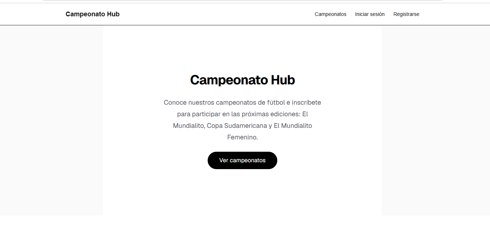
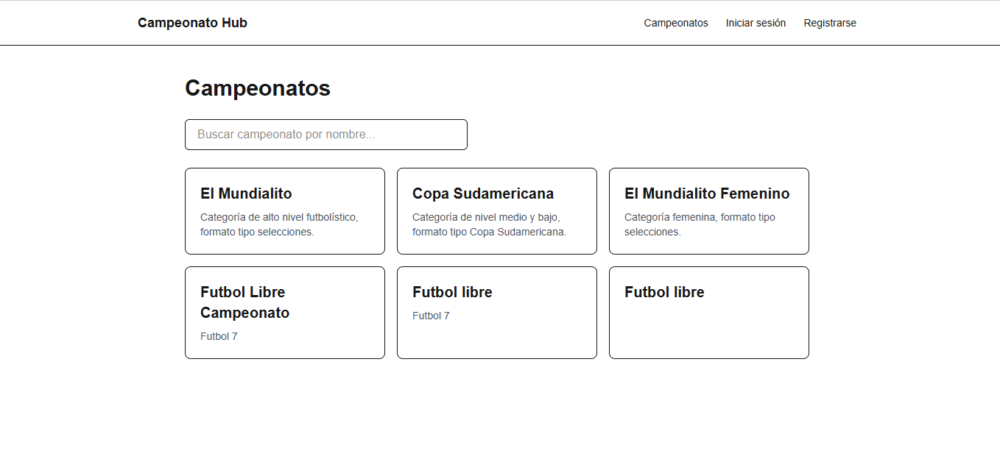
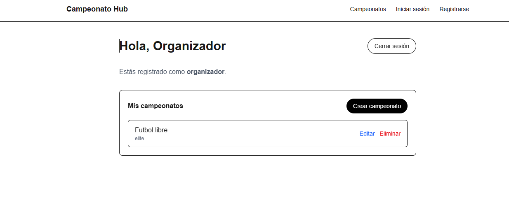

# Campeonato Hub

Plataforma web para la gestión y difusión de campeonatos de fútbol. Permite a organizadores publicar sus campeonatos (Élite, Copa Sudamericana, Femenino) y a los participantes inscribirse a futuras ediciones, dejando los datos de su equipo.

🔗 Demo en vivo: https://campeonato-hub.vercel.app

## Capturas de pantalla





## Stack tecnológico

- Next.js 16 (App Router)
- TypeScript
- Tailwind CSS
- Supabase (PostgreSQL + Auth + RLS)
- Vercel (deploy)
- countries.dev y TheSportsDB (APIs externas)

## Roles de usuario

- **Organizador**: crea, edita y elimina sus propios campeonatos. Cada organizador solo puede gestionar los campeonatos que él mismo creó.
- **Participante**: navega el listado público de campeonatos y se inscribe a la edición de su interés, dejando los datos de su equipo. Solo puede inscribirse una vez por campeonato.

## Modelo de datos

Tres tablas relacionadas en Supabase (PostgreSQL), con Row Level Security activado:

- **perfiles**: extiende `auth.users`. Guarda `nombre` y `rol` (`organizador` / `participante`) de cada usuario.
- **campeonatos**: nombre, categoría (`elite` / `medio-bajo` / `femenino`), descripción, socio asociado y `organizador_id` (FK hacia `perfiles`, relación uno-a-muchos: un organizador puede tener muchos campeonatos).
- **inscripciones**: `usuario_id` y `campeonato_id` (FK), nombre del equipo y teléfono de contacto. Restricciones `unique` para evitar nombres de equipo duplicados dentro de un mismo campeonato y para permitir solo una inscripción por usuario por campeonato.

## Instalación local

```bash
git clone https://github.com/tito2887/campeonato-hub.git
cd campeonato-hub
npm install
cp .env.example .env.local # completar con tus claves de Supabase
npm run dev
```

## Variables de entorno

Crea un archivo `.env.local` en la raíz del proyecto con:

```
NEXT_PUBLIC_SUPABASE_URL=
NEXT_PUBLIC_SUPABASE_ANON_KEY=
```

Ambas se obtienen desde el dashboard de Supabase, en Settings → API Keys.

## Credenciales de prueba

- **Organizador**: organizador.demo@campeonatohub.com / Demo123456
- **Participante**: participante.demo@campeonatohub.com / Demo123456

## Funcionalidades

- [x] Sistema de roles (organizador / participante) con permisos distintos
- [x] Registro, inicio de sesión y cierre de sesión con Supabase Auth
- [x] Protección de rutas privadas con middleware
- [x] Rol guardado en base de datos (no hardcodeado)
- [x] CRUD completo de campeonatos con Server Actions (crear, leer, actualizar, eliminar)
- [x] Inscripción de participantes con validaciones de negocio (equipo duplicado, una inscripción por usuario)
- [x] Componente de búsqueda con `useState` (Client Component)
- [x] Consumo de dos APIs externas (countries.dev y TheSportsDB) con manejo de errores
- [x] Row Level Security configurado en las tres tablas
- [x] Rutas públicas, privadas y dinámica (`[id]`)
- [x] Despliegue en producción en Vercel

## Autor

Tito Carreño — Universitario Rumiñahui, Sistemas y Gestión de Data
GitHub: [@tito2887](https://github.com/tito2887)
